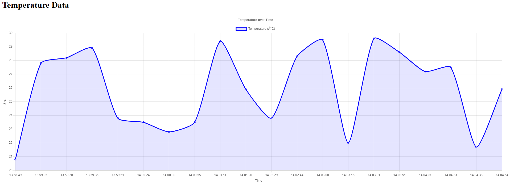
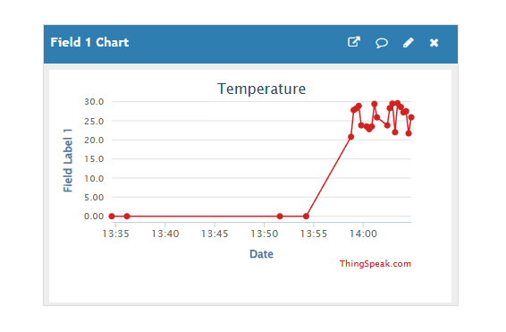

Lopuksi pakollinen raportointi tiedostoista joskin tämä README file on erittäin vaillinainen ja tästä puuttuu paljon tietoja.

IoT-perusteet kansiosta löytyy nyt koodi tehtävät kaikilta luennoilta eli luennot 1-4. Kansiot sisältävät ainoastaan koodit ilman mitään wokwi linkkejä koska en tienyt että niitä olisi pitänyt laittaa myös.
 Viimeisen luennon charttia yritin tehdä niin, että siihen saa jonkin graafisen systeemin myös 

